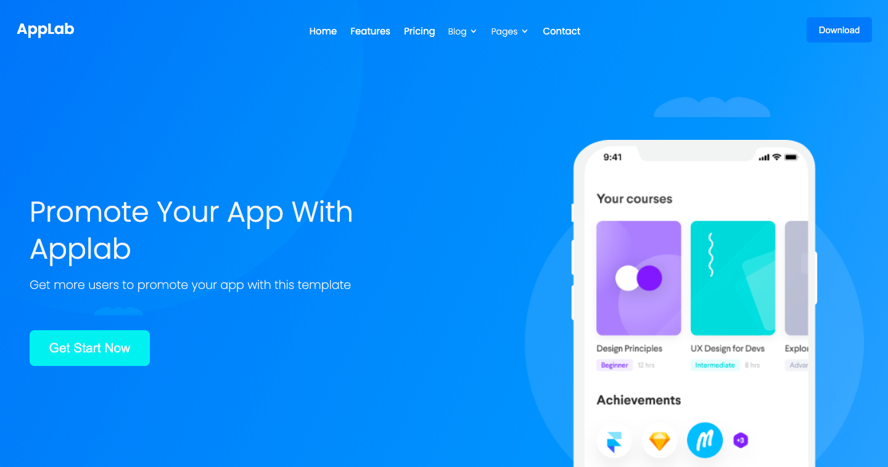

# Thanks for viewing my Project ✨

 

## :star: Live Deployment: https://katarzynadworak.github.io/rwd-website-project/
 

## Main goal of my work was to:
- code **Responsive Web Design (RWD)** site 📱
- do it in a way that it **looks decent on mobiles, tablets and desktops** 🖥️
- use **semantic HTML** (BEM) 📝
- make project **as readable as it is possible** (clean code, many directories, BEM) 📖
 

## Solutions provided in the project
**1.** I use in this project modern CSS functions like **min(), max(), and clamp()** to create a responsive and adaptive design. These functions help ensure that the layout and elements adjust smoothly across different screen sizes and resolutions.

- Responsiveness: Elements adjust dynamically to the screen size, providing a consistent and user-friendly experience across different devices.
- Maintainability: Using these functions even reduces the need for numerous media queries, simplifying the CSS code.
- Design Consistency: Ensures a consistent look and feel, regardless of the screen size, by setting appropriate limits on property values.
- This approach leverages the power of modern CSS to create a more efficient, scalable, and maintainable codebase.

Key Features:
**Clamp() Function:** ensures the margin values are responsive and stay within the defined minimum and maximum limits, adapting to different screen sizes.

    .header__logo {
    margin: clamp(15px, 2vw, 30px) 12px 12px clamp(10px, 2vw, 25px);
    padding: 2px;
    }

**Min() Function:** sets the font size to be responsive, choosing the smaller value between 4% of the viewport width and 15px, ensuring readability across devices.

    .nav__item {
        margin: 11px;
        font-size: min(4vw, 15px);
        position: relative;
        transition: font-weight 0.3s ease, letter-spacing 0.3s ease, transform 0.3s ease;
    }

**Max() Function:** ensures that the margin is at least 10px, but can grow to 2% of the viewport width, providing a flexible and responsive layout for different screen sizes.

    .benefits__img-1, .benefits__img-2, .benefits__img-3 {
        width: 115px;
        height: 115px;
        border-radius: 19px;
        margin: max(10px, 2vw) auto;
        padding: 33px;
    }

**2.** I use CSS code to provide a clean and **functional hamburger menu** that is hidden off-screen by default and smoothly slides into view when the associated checkbox is checked, providing an intuitive and responsive navigation experience for mobile users.

    .nav__menu {
        background-color: #2c2c2c;
        border-radius: 0 0 20px 20px;
        border-bottom: 2px solid #37ebed;
        display: block;
        padding: 20px;
        position: absolute;
        right: 0;
        text-align: center;
        transform: translateX(150%);
        transition: .4s linear;
        top: 100%;
        width: 100%;
        z-index: 1;
    }
      
    .header__input:checked ~ .nav__menu {
        display: block;
        transform: translateX(0%);
    }
      
    .header__hamburger {
        background-color: #f2f4f4;
        cursor: pointer;
        height: 3px;
        position: relative;
        width: 30px;
    }
      
    .header__hamburger::after {
        content: '';
        background-color: #f2f4f4;
        height: 3px;
        position: absolute;
        transform: translateY(-10px);
        width: 30px;
    }
      
    .header__hamburger::before {
        content: '';
        background-color: #f2f4f4;
        height: 3px;
        position: absolute;
        transform: translateY(10px);
        width: 30px;
    }
   
**3.** I also use **Grid** to provide flexibility to footer elements – they can be stretched in one row as well as arranged in two or one column.

 
 

## 🛠️ Languages and Tools used: 

 
 
 
 

## :blue_heart:  You can find me on:
 

 LinkedIn Profile [][linkedin]

 
 

### Thanks
To Colorlib [colorlib.com](https://colorlib.com) for free templates.

To my Mentor - devmentor.pl – for creating the task and for the code review.

